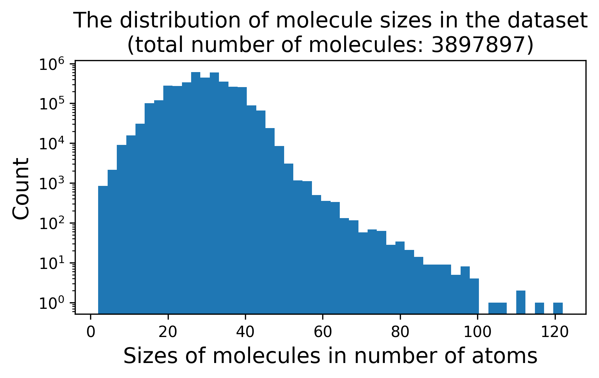

# dataset
the dataset can be found [here](https://drive.google.com/drive/folders/1cUiWKWdU7CQoh67a-ucyb-Na1lSwWjKH?usp=drive_link). it's comprsided of ~3.9 million small molecular structures (atom types and coordinates), their SMILES and SELFIES descriptors and symmetry point groups. the data is structured into 4 .h5 files containing a bit less that 1 million entries each.

, licensed under the GNU General Public License v3.0 (GPL-3.0). in this fork, molecules containing single atoms and those with two non-interacting atoms have been removed to improve data quality. SMILES strings for the molecules were computed using [RDKit](https://github.com/rdkit/rdkit), SELFIES representations using the [SELFIES](https://github.com/aspuru-guzik-group/selfies) library, and molecular symmetry groups were computed using the [SOFI](https://github.com/mammasmias/IterativeRotationsAssignments) library.
