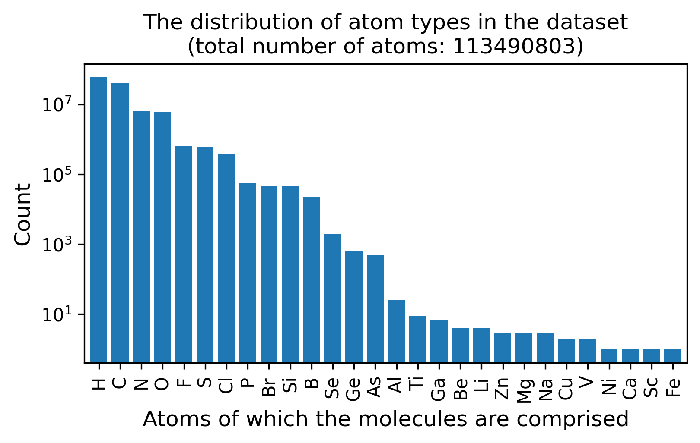
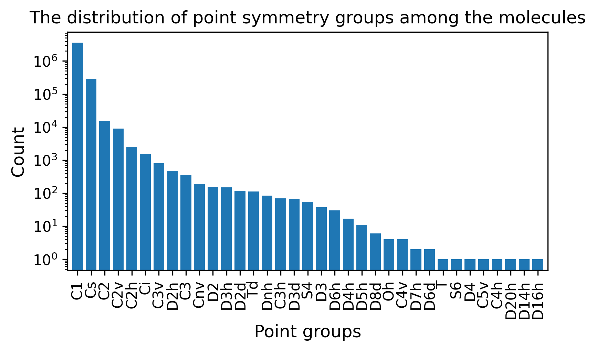

# dataset
the dataset can be found [here](https://drive.google.com/drive/folders/1cUiWKWdU7CQoh67a-ucyb-Na1lSwWjKH?usp=drive_link). it's comprsided of ~3.9 million small molecular structures (atom types, coordinates and an isomer dictionary), their SMILES and SELFIES descriptors, symmetry point groups and various other geometry features, like dimensionality, angles between ring planes, number of non-planar/linear symmetry planes, etc. the data is structured into 8 (4 structure, 4 feature) .h5 files containing entries on a bit less than 1 million molecules each.

  <picture>
    <!-- Dark mode version -->
    <source srcset="example_output_dark.png" media="(prefers-color-scheme: dark)">
    <!-- Light mode version (fallback) -->
    
  </picture>

  <picture>
    <source srcset="dataset_info_dark.png" media="(prefers-color-scheme: dark)">
    
  </picture>

  <picture>
    <source srcset="molecule_atom_type_distribution_dark.png" media="(prefers-color-scheme: dark)">
    
  </picture>

  <picture>
    <source srcset="molecule_point_group_distribution_dark.png" media="(prefers-color-scheme: dark)">
    
  </picture>

# dataset origin
this repository contains a fork of the Molecule3D dataset originally curated by Xu et al. in [Molecule3D: A Benchmark for Predicting 3D Geometries from Molecular Graphs](https://arxiv.org/abs/2110.01717), licensed under GPL-3.0. in this fork, entries containing only 1 atom, fragmented molecules and molecules with non-standard valences have been removed to improve data quality. isomeric molecules were kept with a separate metadata column tracking the indices of molecules with the same canonical SMILES strings. SMILES strings for the molecules were computed using [RDKit](https://github.com/rdkit/rdkit), SELFIES representations using [SELFIES](https://github.com/aspuru-guzik-group/selfies) and point symmetry groups using [SOFI](https://github.com/mammasmias/IterativeRotationsAssignments) libraries together with some modifications and manual error corrections. dimensional analysis was performed using [Principal Component Analysis (PCA)](https://en.wikipedia.org/wiki/Principal_component_analysis).
