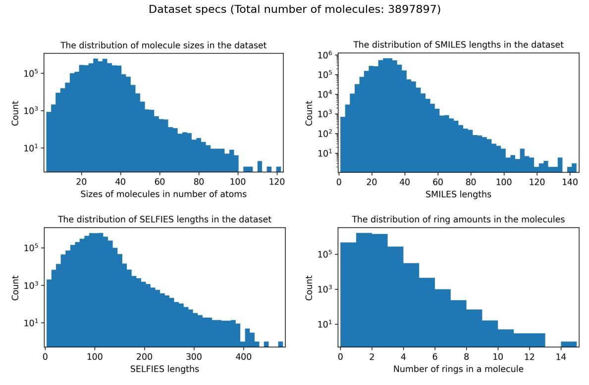

# dataset
the dataset can be found [here](https://drive.google.com/drive/folders/1cUiWKWdU7CQoh67a-ucyb-Na1lSwWjKH?usp=drive_link). it's comprsided of ~3.9 million small molecular structures (atom types, coordinates and an isomer dictionary), their SMILES and SELFIES descriptors, symmetry point groups and various other geometry, like dimensionality, angles between ring planes, etc. the data is structured into 8 (4 structure, 4 feature) .h5 files containing entries on a bit less than 1 million molecules each.

# dataset origin
this repository contains a fork of the Molecule3D dataset originally curated by Xu et al. in [Molecule3D: A Benchmark for Predicting 3D Geometries from Molecular Graphs](https://arxiv.org/abs/2110.01717), licensed under the GNU General Public License v3.0 (GPL-3.0). in this fork, entries containing only 1 atom, fragmented molecules and molecules with non-standard valences have been removed to improve data quality. Isomeric molecules were kept with a separate metadata python dictionary tracking the indices of molecules with the same canonical SMILES strings. SMILES strings for the molecules were computed using [RDKit](https://github.com/rdkit/rdkit), SELFIES representations using the [SELFIES](https://github.com/aspuru-guzik-group/selfies) library and point symmetry groups were computed using the [SOFI](https://github.com/mammasmias/IterativeRotationsAssignments) library together with some modifications and manual error corrections. Dimensional analysis was performed using Principal Component Analysis (PCA).
